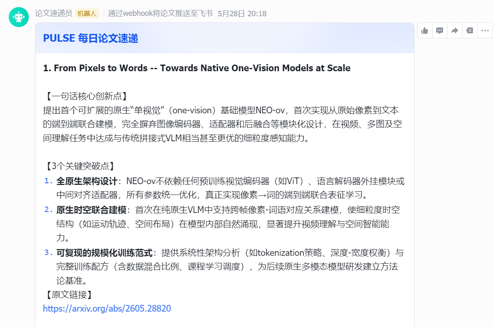

# PULSE — Paper Update & LLM Summarization Engine

全自动前沿 AI 论文追踪与语义提炼 Agent。每日定时从 ArXiv 拉取最新论文，通过大模型提炼核心创新点，自动推送至飞书/钉钉群。

## 效果预览

<!-- 替换为你的截图，放到项目根目录下即可 -->


## 架构

```
ArXiv API → 数据拉取 → 关键词过滤 → SQLite 去重 → Qwen-Plus 摘要 → 飞书卡片推送
                                              ↕
                                          SQLite 缓存
```

## 技术栈

| 组件 | 选型 |
|------|------|
| 数据源 | ArXiv 官方开放 API (ATOM/XML) |
| 大模型 | 阿里云百炼 Qwen-Plus (DashScope SDK) |
| 定时调度 | Windows Task Scheduler + APScheduler |
| 本地存储 | SQLite (论文去重 + 摘要缓存) |
| 消息推送 | 飞书交互式卡片 / 钉钉 Markdown |
| 配置管理 | python-dotenv |
| 测试框架 | pytest |

## 快速开始

```bash
# 1. 创建虚拟环境
python -m venv venv
source venv/Scripts/activate    # Windows

# 2. 安装依赖
pip install -r requirements.txt

# 3. 配置环境变量
cp .env.example .env
# 编辑 .env，填入 DASHSCOPE_API_KEY 和 FEISHU_WEBHOOK_URL

# 4. 单次运行
python -m pulse.main --once
```

## 使用方式

| 场景 | 命令 |
|------|------|
| 手动推送一次 | 双击 `run.bat` |
| 注册 Windows 定时任务 | 管理员 PowerShell 执行 `.\setup_task.ps1` |
| 查看运行日志 | 打开 `pulse.log` |
| 运行测试 | `python -m pytest tests/ -v` |

## 配置项 (`.env`)

```env
DASHSCOPE_API_KEY=     # 阿里云百炼 API Key（必填）
FEISHU_WEBHOOK_URL=    # 飞书机器人 Webhook（必填）
ARXIV_CATEGORIES=      # ArXiv 分类，默认 cs.AI,cs.CL,cs.CV
KEYWORDS=              # 关键词过滤，逗号分隔
MAX_PAPERS=            # 每次最多处理篇数，默认 10
SCHEDULE_TIME=         # 每日推送时间，默认 09:00
LOG_LEVEL=             # 日志级别，默认 INFO
```

## 项目结构

```
PULSE/
├── config/settings.py              # 配置管理中心
├── pulse/
│   ├── models.py                   # Paper 数据模型
│   ├── main.py                     # 主入口 & 调度器
│   ├── ingestion/arxiv_fetcher.py  # ArXiv 数据拉取与解析
│   ├── llm/summarizer.py           # Qwen-Plus 摘要生成
│   ├── delivery/notifier.py        # 飞书/钉钉消息推送
│   └── storage/db.py               # SQLite 数据库操作
├── tests/                          # 单元测试
├── run.bat                         # 一键运行脚本
├── setup_task.ps1                  # Windows 计划任务注册
└── requirements.txt                # 依赖清单
```

## License

MIT
